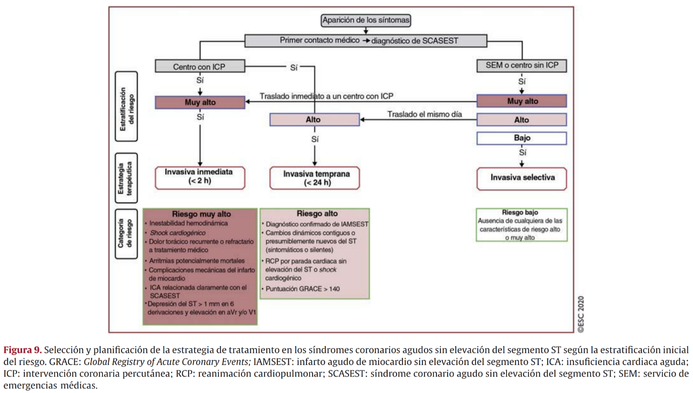
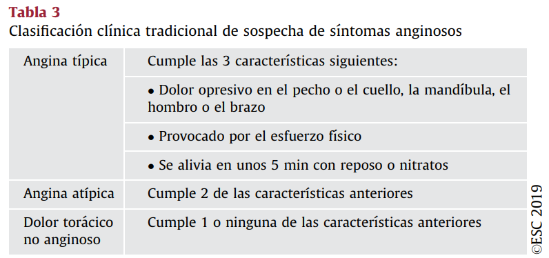
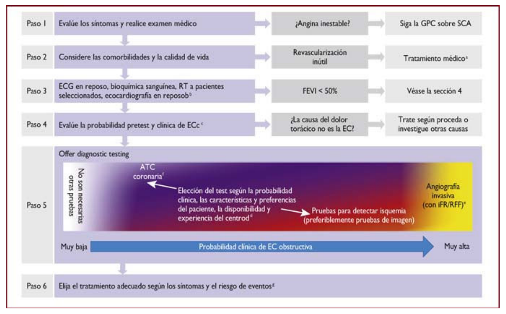
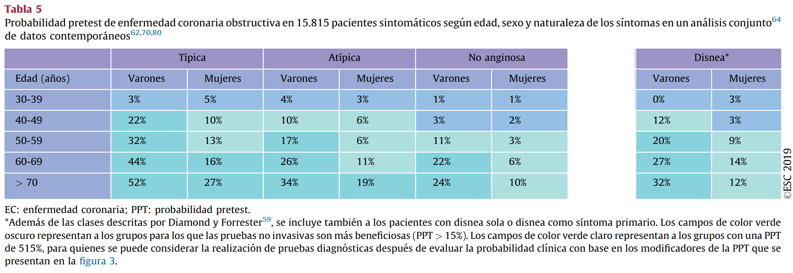
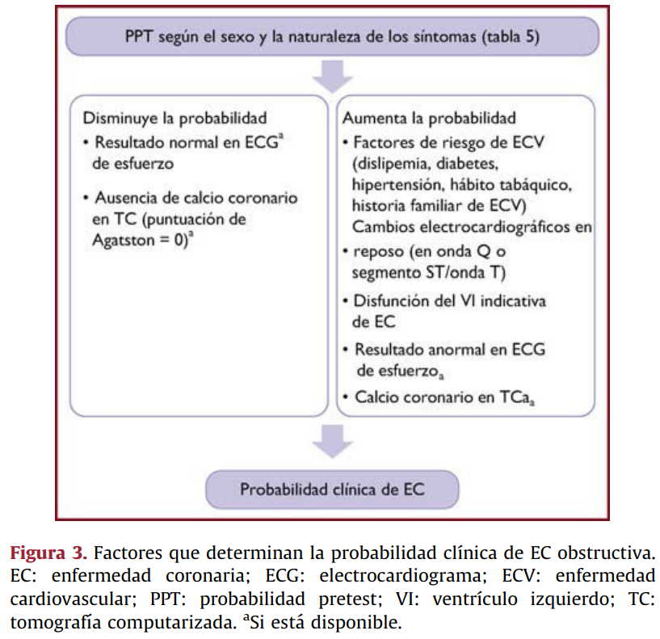
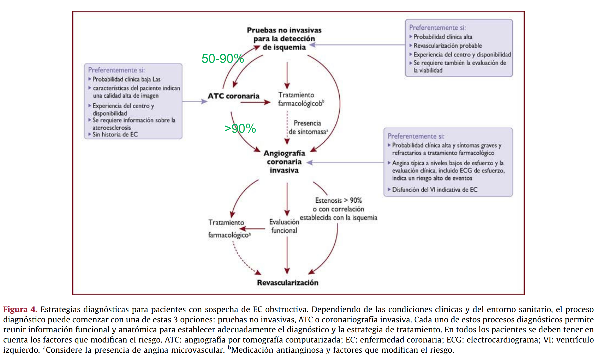

# Internado

[cardio ecg](/cardiologia/criterios_ecg/README.md)

## Cardiología
### Emergencias hipertensivas

### Insuficiencia cardíaca

[diagnóstico IC FEp](https://watermark.silverchair.com/eurheartj_40_40_3297.pdf?token=AQECAHi208BE49Ooan9kkhW_Ercy7Dm3ZL_9Cf3qfKAc485ysgAAAt8wggLbBgkqhkiG9w0BBwagggLMMIICyAIBADCCAsEGCSqGSIb3DQEHATAeBglghkgBZQMEAS4wEQQMXzL2Z-LI4xwE61X3AgEQgIICkioZWPCBa0Slu2-xjwqE-7CY7IDTrxn8V2mwaXRq157imkH1ZkJ8dK4BMfye8O0PcCLPRMJVka9pxzS_qXCWPIXLhrd_xD-lcaxc4uhnf0zdiFES_cjI3kchJaBw3UN0r3SJEkJ9w_I79WUukFk3Tfu75ldqdogKtKE8xEpSqc1nf2F6DqzqQ3Pi0WQKLAl8b3llvfx8oeDUlXuk1eZ2tYmNvsJ0MjRvfkpAEhlr0AzBlP6MaanUY8pkn84LSilprn-akinE8XtwK5u60W3ETZtF8f6yuiJZABkJsq_-Zv3kK8pEQIFBK5JYgQrKhkvukArJ78lHRTf1mJ93i-8CnRmvmcNDYGhQWpifx-3SB63csGP5wxieijmr5IP_1PwpZvCBesNGp2gAswdx2EYDqSaF2C0MMj_iIh4_geOLBTxWS1Jhq7Teg24jfTjthl7cHEnRz6UyVKAI82dGurMNuSHpWZAspvP5X24E3qxQu-yO8WVqKUeyNYj2JN8D_unZwGoUc9qvFN92jHmHNh3S5fN0_9gZArQ3b76OoPu3pSIgbLx-FumJIBg1Rak41NssuK6_QNQhGdiIb_kqA78gT3EFToLdwg3-mRVQ8244HziDmRmBBAy5tZeM8mldud8xc7zdv6Oyhk-ALr7FG6ID75dXo2HAOOqKqmTgQw0GJMQrR06pftvdsAHK9L85rCJFqlWpAZWAuK3kbVnILaOdKzb2LYowcRgGl6InuK6-l2P5-zk5IpOyzHdF53UTOR9l0GdKAuKjnytFIDNd-6VY0fYwcZZHpphK3YlEXo22uhxj1tMiEJawsRhRsNg1O5w1mXAgSGtDAN2y63MbIjeEIbXViZH0nnnbHn8020KqQ80uovk)

### Selección y planificación revascularización en SCA
| muy alto riesgo | alto riesgo | riesgo bajo |
|---|:---:|:---:| 
| invasiva inmediata (1-2h) | invasiva precoz (24h) | invasiva selectiva| |
| 1) **Inestabilidad** HDN | 1) diagnóstico confirmado **IAMSEST** |
| 2) **Shock** cardiogénico | 2) **Cambios dinámicos** contiguos o presumiblemente nuevos en el ECG | |
| 3) **ICA** relacionada claramente con el SCASEST | 3) RCP por **PCR** sin elevación de ST o shock cardiogénico |
| 4) **Arritmias** potencialmente mortales | 4) **GRACE** > 140 |
| 5) Complicaiones **mecánicas** de IAM | |
| 6) (**sospecha enf multivaso**) Depresión ST > 1mm en 6  derivaciones y elevación en aVR o V1 |
| 7) **Dolor torácico **recurrente o refractario a tto médico | |

### Síndromes coronarios crónicos
1) pacientes con sospecha de EC y síntomas de **angina «estable» o disnea**;
2) pacientes con un **nuevo episodio de IC** o disfunción del VI y sospecha de EC;
3) pacientes asintomáticos y sintomáticos con síntomas estables **menos de 1 año** después de sufrir un **SCA** o pacientes revascularizados recientemente;
4) pacientes asintomáticos o sintomáticos tras **más de 1 año** desde el diagnóstico inicial o la revascularización; 
5) pacientes con angina y sospecha de **enfermedad vasoepástica o microvascular**, y
6) sujetos asintomáticos en los que se detecta **EC en el cribado**

Clasificación angina

### Selección de prueba diagnóstica para px con "1)"
Probabilidad pretest
| |   |
|:---:|:---:|

## Nefrología
### ácido-base

## Glomerulopatías
### Síndrome nefrótico

## Infectología
### Espectro antibiótico

## Broncopulmonar
### Asma

### Dosis corticoides
Ejemplo presentación y dosis media: budesonida-formoterol 200/6 mcg 2 puff inhalada 2 veces al día

### Insuficiencia respiratoria aguda

## Geriatría

## Endocrinología

### Tiroides
Grupos tamizaje hipotiroidismo:

- Antecedentes de cirugía tiroidea, terapia con radioyodo o radioterapia cervical.
- Disfunción tiroidea previa conocida.
- Presencia de anticuerpos antitiroideos.
- Hipercolesterolemia.
- IMC > 30.
- Infertilidad.
- Embarazadas.
- Hallazgo de bocio al examen físico.
- Uso crónico de amiodarona o litio.
- < de 65 años con Depresión confirmada.
- ≥ de 65 años con sospecha de depresión o trastornos cognitivos.
- Síndrome de Down.
- Síndrome de Turner.
- Antecedente personal de otras enfermedades autoinmunes:
  - Diabetes Mellitus 1.
  - Sindrome Sjögren.
  - Esclerosis sistémica progresiva.
  - Artritis reumatoide.
  - Enfermedad de Addison.
  - Enfermedad celíaca.
  - Vitiligo.

# fármacos con dosis y presentaciones

| fármaco | presentación | dosis | comentarios |
|:---:|:---:|:---:|---|
| Adrenalina | 1mg/ml | 1mg iv en PCR, 0.3 a 0.5 mg im en anafilaxia | |
| Adenosina  | 6mg/2ml | 1a 6 mg iv, 2a 12mg iv | usualmente en taquicardia qrs angosto regular, podría usarse en qrs ancho regular para dx TV vs TSV |
