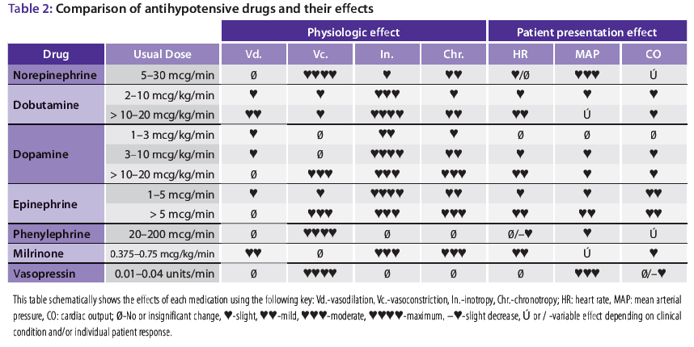
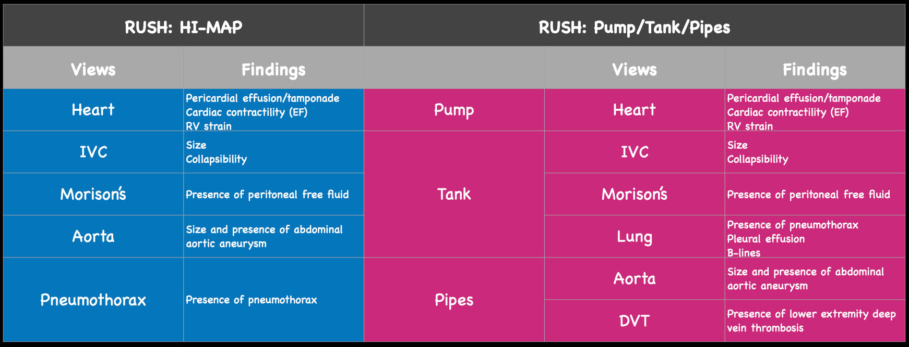
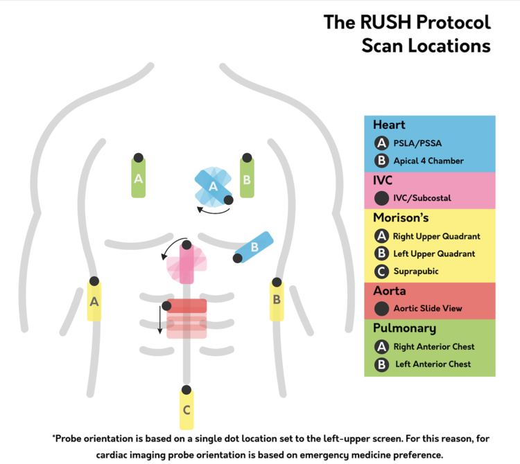
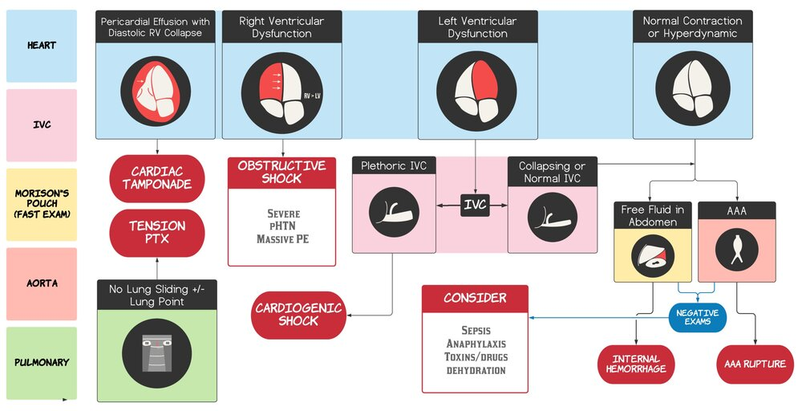
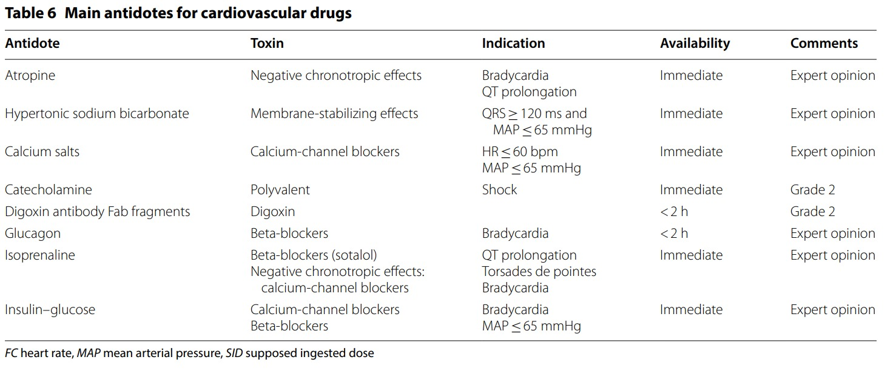

# Manejo de Vía aerea

Fármacos para inducción:

| Medicamento | Mecanismo | Dosis | inicio | duración | Pros | Contras |
| ----------- | - | ---- | --------------- | --- | ---- | ------- |
| Etomidato | potencia receptor GABA |0.3 mg/kg | 15 s | 3 a 12 min | sin fx HDN, reduce flujo y metabolismo cerebral | inhibe la síntesis de cortisol, no usar en sepsis ni px con insuf renal relativa (puede necesitar dosis inicial de GC). Neuroexitabilidad |
| Ketamina | potencia GABA y agonista OP | 1.5 - 2 mg/kg | 45 a 60 s | 10 a 20 min | Estimula secreción catecol, broncodilat, analgesia disociativa (sin depresión centro respi) | Por más catecolaminas, no utilizar en alteración cardio porque aumenta consumo de O2, terrores al despertar, alucinaciones, hipertensión y taquicardia (por aumento de catecolaminas, si ya están agotadas por sepsis u otros, da hipoT y bradicard), ↑ secreciones |
| Propofol | agonista GABA | 1.5 - 3 mg/kg | 15 a 45 s | 5 a 10 min | Broncodilat, dismuye metabolismo cerebral, ANTICONVULSIVANTE | ↓ presión arterial (hasta 10 mmHg de PAM) |
| Midazolam | aumenta frecuencia apertura GABA | 0.1 - **0.3** mg/kg | 30 a 60 s | 15 a 30 min | ANTICONVULSIVANTE, pero se usa como último recurso | Hipotensión |

Ojo ketamina da harta taquicardia

Midazolam es lo más disponible fuera de los hospitales. Sin embargo, su dosis es super errática y su efecto es muy variable. 

Fármacos para bloqueo neuromuscular:

| Medicamento | Mecanismo | Dosis | inicio | duración | Pros | Contras |
| ----------- | - | ---- | --------------- | --- | ---- | ------- |
| Succinilcolina | despolarizante | 1.5 mg/kg | 45 a 60 s | 5 a 10 min | Rápido inicio y corta duración | Sin reversor, Hiperkalemia, rabdomiolisis, fasciculaciones, hipertermia maligna, bradicardia (por estimulación muscarínica |
| Rocuronio | no despolarizante (sitio alostérico) | 1.2 mg/kg (en secuencia de intubación rápida, porque en intubación en pabellón se usa la mitad o menos, para que dure menos tiempo) | 45 a 60 s | 30 a 60 min | Reversor neostigmina pero se necesitaría mucho y ¿gabaex?, No hiperkalemia, no fasciculaciones, no hipertermia maligna |  |

Por duración y tiempo de inicio se puede elegir. Si va a ser difícil: succinilcolina, porque si me equivoco, dejará de hacer efecto en 5 a 10 minutos y se puede continuar ventilando con mascarilla con reservorio o ambú. Si no, rocuronio, porque se puede estar intentando varias veces con plan A, B, C, etc. 

# Drogas vasoactivas

Si hay evidencia de Shock Cardiogénico de preferencia usar Norepinefrina, menor mortalidad que Dopamina en este escenario (NEJM 2010; 362: 779-89).
Si Shock Anafiláctico: Adrenalina.
Si Shock Séptico con bajo Gasto Cardiaco y adecuada reanimación con volumen: Evaluar uso de Dobutamina como 1a opción.
Si Shock Obstructivo: Mejorar primero la causa, se sugieren vasopresores y evitar uso de inótropos.

¿Qué dosis? Norepinefrina desde 0,1 ug/kg/min, no hay una dosis tope descrita aunque se sabe que mayor a 0,3 ug/kg/min ya la mortalidad es tan alta como un 60% o más.

# Ecografía

[POCUS atlas](https://www.thepocusatlas.com/shock)

# TEC 
| Complicación | Hallazgos |
| --- | --- |
| fracturas craneales | herida contusa en región parietal izquierda |
| fractura base de craneo | otorragia, rinorragia, equimosis periorbitaria ("ojos de mapache"), hemotimpano, equimosis retroauricular (signo de Battle), déficit de pares craneales|
| contusión cerebral | alteración de conciencia, focalidad neurológica, convulsiones |
| hemorragia sub aracnoidea | cefalea, náuseas, vómitos, rigidez de nuca, fotofobia, alteración de conciencia |
| hematoma epidural (extradural) | cefalea, náuseas, vómitos, alteración de conciencia, focalidad neurológica, convulsiones |
| hematoma subdural | cefalea, náuseas, vómitos, alteración de conciencia, focalidad neurológica, convulsiones |
| herniación | alteración de conciencia, focalidad neurológica, convulsiones, signos vitales alterados |
| lesiones penetrantes | herida en cuero cabelludo, herida en cara, herida en cuello, herida en tórax, herida en abdomen, herida en extremidades, herida en región perineal |

Signos de presión intracraneana elevada: asimetría pupilar, 
Triada de cushing: bradicardia, hipertensión arterial y respiración irregular. 

# Intoxicaciones
Antídotos para intoxicaciones específicas e indicaciones
.jpeg)

